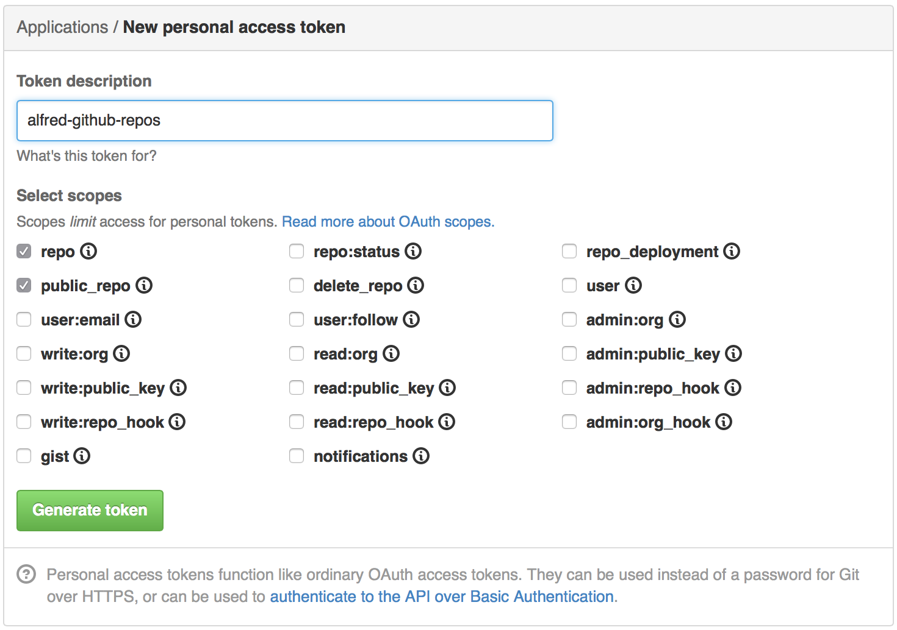

Quickly find your GitHub repositories from [Alfred](http://www.alfredapp.com/).

# Download from Packal

<http://www.packal.org/workflow/github-repos>

# Usage

This workflow searches among your public and private repositories (including organizations you belong to) and opens them on GitHub.

### Identify yourself

This workflow searches on github and within your public and private repositories (including organizations you belong to). So you need to provide an access token to make things easy.

To generate an access token, go to [create a new personal access token](https://github.com/settings/tokens/new). You can enter any description and it just need to be checked the `repo` and `public_repo` option (read private and public repositories).

Then **copy the token** (as it will be visible only that time!), and authenticate in Alfred:

    gh-auth YOURTOKEN

This will store your token and you will be able to use the following commands:

### List and search repositories

List all of your own repositories

    gh

Filter your own repositories and search all repositories on github by *keyword*

    gh keyword

List all repositories of a specific github user

    gh user/

Filter repositories of a specific github user by *keyword*

    gh user/keyword

### Update local cache

To avoid hitting the GitHub API every time you do a search, and to return results faster, the workflow caches all your repositories the first time you do a search. If you create a new repository, you'll need to rebuild your local cache with:

    gh-update

Note: the local cache will only be used for your own repositories. Once you provide a keyword, the workflow will search on github using the github API. Response times may be slower in this case.

# License

This is released under the [MIT License](http://opensource.org/licenses/MIT).

# Feedback

[@edgarjs](http://twitter.com/edgarjs)
