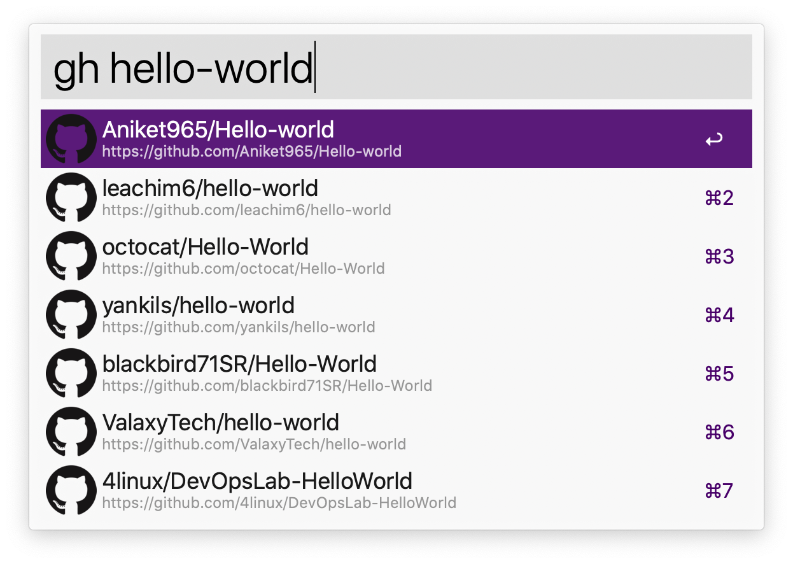
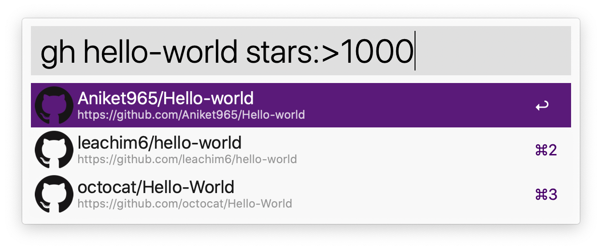

# GitHub Repos workflow for Alfred

This is a custom workflow for the [Alfred app][alfred-app] that lets you search and open a GitHub repository via the GitHub Search API.

## Authentication

You'll need to authenticate with a personal access token that you can generate in the [GitHub developer settings page][personal-access-token] or by running the `gh-token` command in Alfred.

After you have copied your personal access token, run `gh-login <your-token>` to set your personal access token.

## Usage

Here's the list of available commands.

### Global Search: `gh <query>`



The example above will search for repositories with the string "hello-world" in their name. Internally this uses the [GitHub Search syntax][github-search], so you can use modifiers like:



This will search only in repositories that have more than 1000 stars.

> Please note that this command only searches in the repository name. This means that your query will be appended with the `in:name` modifier. So when you type in `hello-world`, the final search query sent will be: "hello-world in:name".

### Search your repositories: `repo [query]`

This command works the same as the previous one (`gh <query>`) but it limits the search to your own repositories.

> This includes repositories from your organizations as well.

### Search Pull Requests: `pr [query]`

This command searches within the Pull Requests that you're involved in.

If you want to limit the search to be under your organisations, please remove `PR_ALL_INVOLVE_ME` environment variable

### Open notifications: `gh-notifications`

This command just opens your [GitHub notification][notifications-page] page.

## Config Cache TTL

You can customise the TTL for the internal caches of Repos/Organisations/PullRequests by seting the following
environment variables. (all in seconds)

```
> CACHE_TTL_SEC_ORG  default: 86400
> CACHE_TTL_SEC_PR  default: 300
> CACHE_TTL_SEC_REPO default: 86400
```


## Configuring host for Enterprise

If you're using an Enterprise account, you can call the `gh-host <host>` command.

---

## Contributing

You can submit your bug reports or feature requests at:
https://github.com/edgarjs/alfred-github-repos/issues

If you want to submit a Pull Request, please follow these simple guides:

1. Add a detailed description of what you're changing and why.
2. Add necessary unit tests that cover your changes.
3. Don't increase the version of the workflow in your changes.

Here are some ideas for Pull Requests:

- [ ] Make search faster
- [ ] Search commits in a repository
- [ ] Search projects in an organization
- [ ] Improve icon graphics

## License

This project is published under the [MIT License](LICENSE.md).

[alfred-app]: https://www.alfredapp.com/
[github-search]: https://docs.github.com/en/free-pro-team@latest/github/searching-for-information-on-github/searching-on-github
[download-packal]: https://www.packal.org/workflow/github-repos
[download-releases]: https://github.com/edgarjs/alfred-github-repos/releases
[personal-access-token]: https://github.com/settings/tokens/new?description=Github%20Repos%20Alfred%20workflow&scopes=repo
[pulls-page]: https://github.com/pulls
[notifications-page]: https://github.com/notifications
[alfred-env-vars]: https://www.alfredapp.com/help/workflows/script-environment-variables/
